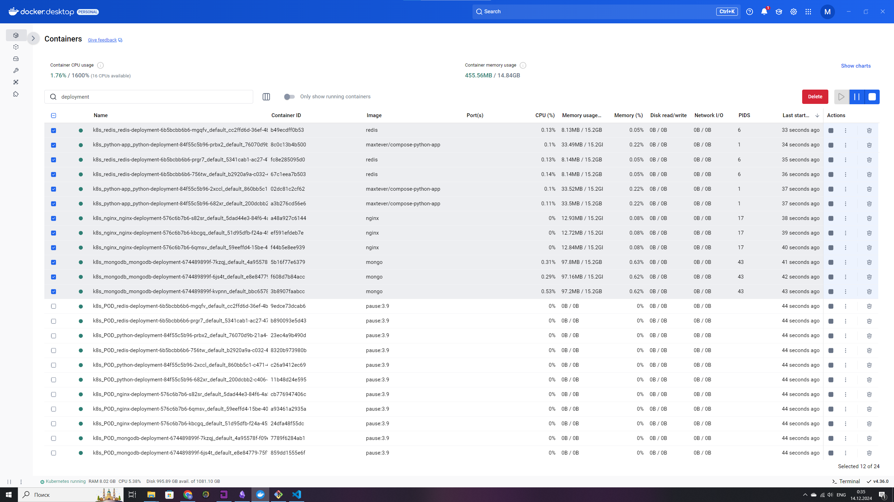

# kuber-practice

## Update

Изменено количество реплик для деплоймента, и изменен базовый образ на `python:3.10-slim` для app.py

### Создание деплойментов 

Для использования образа Python-приложения, созданного в предыдущем задании, необходимо опубликовать его в DockerHub. Вот пример Dockerfile для создания образа:

```
FROM python:3.10-slim
WORKDIR /app
COPY requirements.txt .
RUN pip install --no-cache-dir --upgrade -r requirements.txt
COPY . .
EXPOSE 8000
CMD ["uvicorn", "app:app", "--host", "0.0.0.0", "--port", "8000"]
```

После создания и публикации образа в DockerHub, можно приступать к созданию деплоймента для Python-приложения.

Деплоймент для приложения на питоне будет брать образ с dockerhub.

```
apiVersion: apps/v1
kind: Deployment
metadata:
  name: python-deployment
spec:
  selector:
    matchLabels:
      app: python-app
  replicas: 3
  template:
    metadata:
      labels:
        app: python-app
    spec:
      containers:
      - name: python-app
        image: maxtever/compose-python-app:latest
        ports:
        - containerPort: 8000
```

Деплойменты nginx, redis и mongo используют базовые образы.

Для того чтобы запустить используется команда, так как все манифесты находятся в одной папке:   `kubectl apply -f .` либо можно запускать все по отдельности: 

```
kubectl apply -f python-deployment.yaml
kubectl apply -f nginx-deployment.yaml
kubectl apply -f redis-deployment.yaml
kubectl apply -f mongo-deployment.yaml
```

для того чтобы проверить состояние запущенных деплойментов

```
kubectl get deployments
```

вывод: 

```
NAME                 READY   UP-TO-DATE   AVAILABLE   AGE
mongodb-deployment   2/2     2            2           2m17s
nginx-deployment     1/1     1            1           2m17s
python-deployment    1/1     1            1           2m17s
redis-deployment     1/1     1            1           2m17s
```

Чтобы посмотреть детали:
`kubectl describe deployments python-deployment`
``
```
Name:                   python-deployment
Namespace:              default
CreationTimestamp:      Sat, 30 Nov 2024 18:32:24 +0300
Labels:                 <none>
Annotations:            deployment.kubernetes.io/revision: 1
Selector:               app=python-app
Replicas:               1 desired | 1 updated | 1 total | 1 available | 0 unavailable
StrategyType:           RollingUpdate
MinReadySeconds:        0
RollingUpdateStrategy:  25% max unavailable, 25% max surge
Pod Template:
  Labels:  app=python-app
  Containers:
   python-app:
    Image:         maxtever/compose-python-app:latest
    Port:          8000/TCP
    Host Port:     0/TCP
    Environment:   <none>
    Mounts:        <none>
  Volumes:         <none>
  Node-Selectors:  <none>
  Tolerations:     <none>
Conditions:
  Type           Status  Reason
  ----           ------  ------
  Available      True    MinimumReplicasAvailable
  Progressing    True    NewReplicaSetAvailable
OldReplicaSets:  <none>
NewReplicaSet:   python-deployment-84f55c5b96 (1/1 replicas created)
Events:
  Type    Reason             Age    From                   Message
  ----    ------             ----   ----                   -------
  Normal  ScalingReplicaSet  4m15s  deployment-controller  Scaled up replica set python-deployment-84f55c5b96 to 1
```

### Создание сервисов 

Для обеспечения доступа к портам контейнеров были созданы сервисы:

```
apiVersion: v1
kind: Service
metadata:
  name: nginx-service
spec:
  selector:
    app: nginx
  ports:
    - protocol: TCP
      port: 80
      targetPort: 80
  type: LoadBalancer
```

```
kubectl get services
NAME              TYPE           CLUSTER-IP      EXTERNAL-IP   PORT(S)        AGE
kubernetes        ClusterIP      10.96.0.1       <none>        443/TCP        31d
mongodb-service   ClusterIP      10.101.168.14   <none>        27017/TCP      7m10s
nginx-service     LoadBalancer   10.100.191.32   localhost     80:30892/TCP   6m46s
python-service    ClusterIP      10.96.133.20    <none>        8000/TCP       80s
redis-service     ClusterIP      10.106.55.85    <none>        6379/TCP       22s
```

