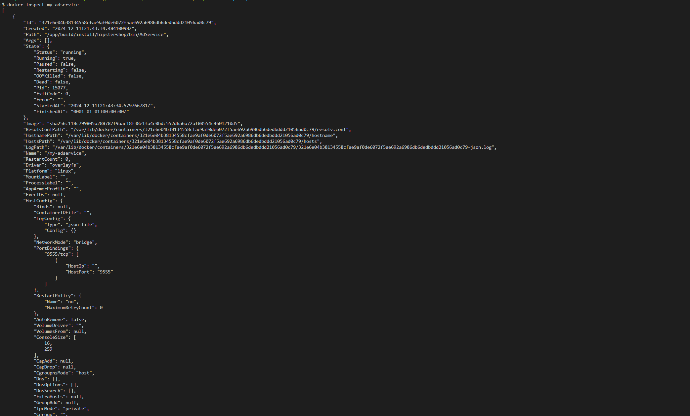
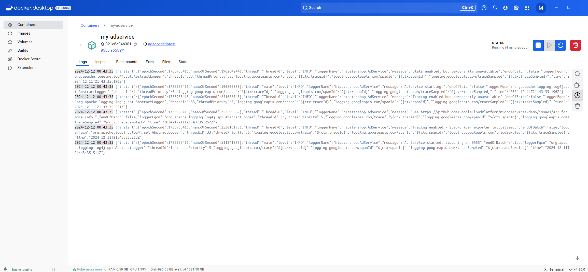
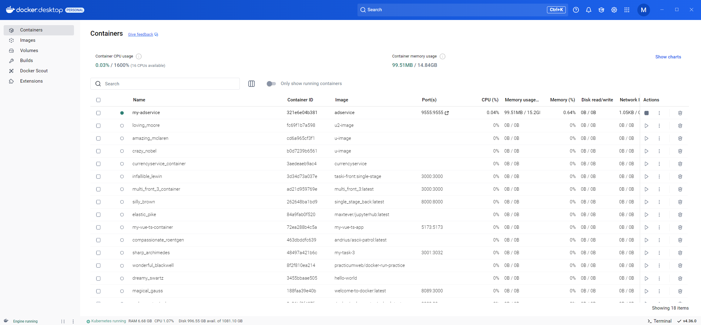
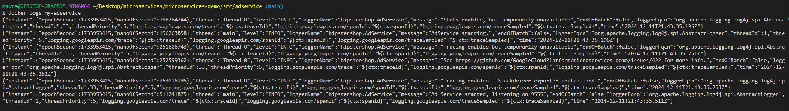

# Задание 2 

- Выбрать один из микросервисов  https://github.com/GoogleCloudPlatform/microservices-demo  
- Развернуть через Docker  
- Сколькими способами можно посмотреть  содержимое конкретного файла в контейнере?

Я разворачивал `currencyservice`, для этого пришлось изменить в проекте переменные окружения и в `Dockerfile`.

### Сборка образа 

``` docker build -t currencyservice ```

### Запуск контейнера 

``` docker run -d --name currencyservice_container -e PORT=7000 -e DISABLE_PROFILER=true currencyservice ```


Я решил развернуть другой сервис и более детально описать процесс:

1) Клонируем репозиторий с помощью `git clone`
2) Далее переходим в папку с сервисом `cd src/adservice`
3) Чтобы собрать образ используем команду `docker build -t adservice .` , в данной команде используется флаг -t чтобы задать имя контейнеру.
5) Далее запускаем контейнер командой: `docker run -d --name my-adservice -p 9555:9555 adservice` 
	- флаг -d используется для запуска контейнера в фоновом режиме 
	- флаг -p используется для запуска на определенном порту
	- --name используется чтобы задать имя контейнеру 
	





  



### Способы просмотра конкретного  файла в контейнере
1) Использовать Docker Desktop
    - Нужно запустить контейнер и перейти во вкладку Files, где будет вся файловая система контейнера. Там же можно редактировать и удалять файлы.
2) Консольные команды 
    - Просмотр папок в контейнере: 
        - ```docker exec -it my-adservice ls src/main```
    - Просмотр содержимого файла: 
        - ```docker exec -it my-adservice cat build.gradle```
    - Копирование файла из контейнера на хост машину: 
        - ```docker cp my-adservice:/build.gradle ./build.gradle ```
        - После этого можно посмотреть файл: 
            - ```cat ./build.gradle ```
    