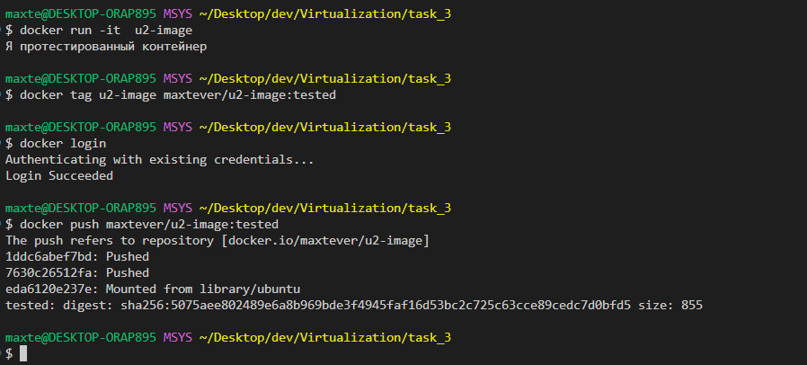
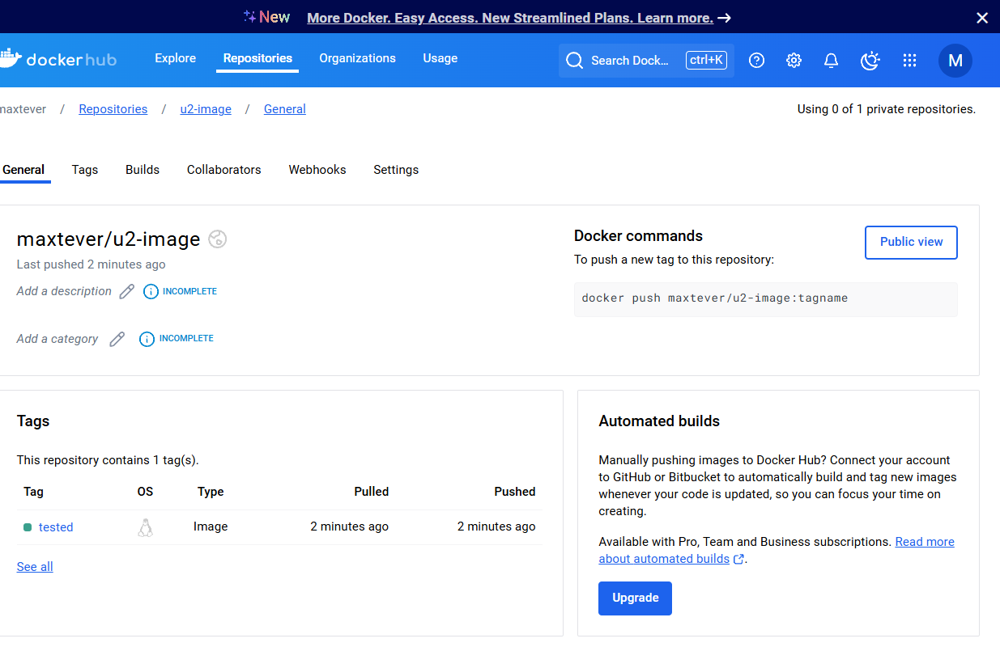

# Задание 3

- Перед развертыванием публичного  контейнера внутрь корпоративного контура компания N приняла решение внедрить  следующую стратегию поведения:  
	- Развернуть контейнер с публичным образом  
	- Запустить в нем скрипт test.sh  
- Добавить протестированный образ в свой аккаунт  Docker Hub с тегом tested

Для выполнения данного создания нам нужно создать Dockerfile в котором мы будем пулить публичный образ, или можно воспользоваться командой `docker pull ubuntu:latest`

В директории с Dockerfile нужно создать файл test.sh.

Чтобы добавить скрипт, в Dockerfile нужно создать слой COPY, который будет копировать файл test.sh

Чтобы при запуске контейнера запускался скрипт нужно в Dockerfile добавить `CMD ["/bin/bash", "./test.sh"]`

Далее собираем образ с помощью команды `docker build -t u2-image .`

Для запуска контейнера нужно использовать команду `docker run -it  u2-image`

После запуска контейнера сработает скрипт из test.sh и в консоли появится сообщение `Я протестированный контейнер` 

Чтобы добавить протестированный образ в DockerHub нужно выполнить команды с тегом tested
- `docker tag u2-image maxtever/u2-image:tested` - добавляем тег 
- `docker login` - авторизуемся в dockerHub
- `docker push maxtever/u2-image:tested` - пушим в dockerHub

