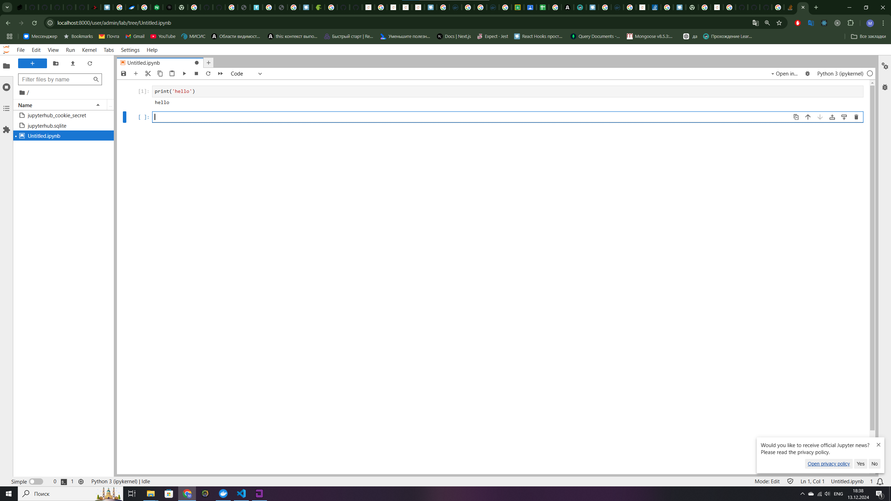

# Задание 4

- Запустить контейнер JupiterHub  
- Собрать докер образ, в котором  
	- параметром выступает корневая директория  
	- Внутри докерфайла задается переменная окружения  с именем администратора  
- Запушить образ в Docker Hub  
-  Сделать Docker-Compose  
	-  Внутри сделать volume  
-  Сделать CI пайплайн, который будет собирать  контейнер JupiterHub, тестирует (вывод tested в  консоль) и отправлять контейнер в репозиторий  
	-  GitHub Actions  
	- ИЛИ Gitlab CI


## Update

После ночных экспериментов с проблемой  при авторизации в jupiterhub и проблемой со спавном ноутбуков. Были внесены следующие изменения: 

1) Добавлены изменения в Dockerfile
2) Небольшие правки docker-compose
3) Добавлен jupyterhub_config.py 

## 1 Изменения в Dockerfile

 Добавлена дополнительная установка зависимостей: 

`RUN pip install --no-cache-dir jupyterlab jupyter_server`

При запуске в логах возникала ошибка без данной зависимости, с использованием базового образа `jupyter/minimal-notebook:latest`, при использовании  `jupyterhub/jupyterhub:latest`  данной ошибки не было.

Добавлено копирование конфигурационного файла `jupyterhub_config.py` :

`COPY jupyterhub_config.py /srv/jupyterhub/jupyterhub_config.py`

Были внесены изменения в CMD теперь при запуске  указывается файл конфигурации, который будет использоваться для настройки JupyterHub:

`CMD ["jupyterhub", "--config", "/srv/jupyterhub/jupyterhub_config.py"]`

## 2 Правки docker-compose 

Вместо использования готового образа теперь используется локальный Dockerfile для сборки образа. Это означает, что контейнер будет собираться на основе Dockerfile, который находится в текущей директории: `build: .`  и была удалена секция `command`.

Далее был изменен блок с volumes, теперь будет использоваться два volume первый для хранения ноутбуков: 

`build: ./data:/home/jovyan/all_notebooks`

Второй volume используется для хранения конфига: 

`./jupyterhub_config.py:/srv/jupyterhub/jupyterhub_config.py`
``

## 3 Добавление конфига 

Для исправления ошибки авторизации и спавна ноутбуков был добавлен конфиг, для jupyterhub. 

Важно отметить, что данный конфиг нельзя использовать для прода, так как здесь используется `jupyterhub.auth.DummyAuthenticator`, который позволяет использовать любое имя или пароль без создания локальных пользователей. 

Для решения проблем со спавнером используется `SimpleLocalProcessSpawner`, который не требует предварительного существования локальных пользователей. Однако его не рекомендуется использовать в продакшене, так как он не позволяет изолировать разных пользователей.

Чтобы реализовать использоваление глобальных переменных, нужно использвать `import os` в конфиге для jupyter, но я не успел это протестировать.


```
# Используем DummyAuthenticator

c.JupyterHub.authenticator_class = 'dummy'

# Разрешаем всем пользователям входить
c.DummyAuthenticator.allow_all = True

# Устанавливаем администратора
c.JupyterHub.admin_users = {'admin'}

# Разрешаем создание системных пользователей
c.LocalAuthenticator.create_system_users = True

# Устанавливаем рабочую директорию для Jupyter Notebook
c.Spawner.notebook_dir = '/home/jovyan/all_notebooks'

# Устанавливаем spawner
c.JupyterHub.spawner_class = 'jupyterhub.spawner.SimpleLocalProcessSpawner'
```


Результат внесения изменений: 




### Dockerfile
На первом шаге я создавал Dockerfile для создания базового образа. Сначала я пытался использовать базовый образ Python, но столкнулся с проблемами при установке зависимостей. В результате, я решил использовать базовый образ `jupyter/minimal-notebook:latest`, который предоставляет готовую среду для запуска Jupyter Notebook. Это решение привело к увеличению размера образа, но упростило установку зависимостей.

По заданию, чтобы Dockerfile принимал параметр корневой директории, нужно указать:

```
ARG ROOT_DIR=/home/jovyan
ENV ROOT_DIR=${ROOT_DIR}
```

Далее нужно установить переменную окружения:

`ENV JUPYTERHUB_ADMIN_NAME=admin`

Для сборки образа используется команда:

```
docker build -t your_dockerhub_username/jupyterhub:latest --build-arg ROOT_DIR=/home/jovyan .
```

После успешной сборки образа, по заданию нужно запушить образ в DockerHub. Для этого нужно выполнить следующие команды:

```
docker login
docker tag maxtever/jupyterhub:latest maxtever/jupyterhub:latest
docker push maxtever/jupyterhub:latest
```

### docker-compose

Создаем сервис `jupiterhub`, в котором будет использоваться образ, созданный с помощью Dockerfile. Далее указываем порты, окружение и задаем volume. Также для проверки используется healthcheck со следующими параметрами. Это будет использоваться в CI pipeline:

```
healthcheck:
      test: ["CMD", "curl", "-f", "http://localhost:8000/hub/health"]
      interval: 1m30s
      timeout: 30s
      retries: 5
      start_period: 30s
```

### CI Pipeline 

При создании пайплайна я указал, что он должен запускаться при push в ветку `main` и при изменениях в файлах `.github/workflows/**`, `jupyter`, `Dockerfile`, `docker-compose.yml`.

Далее я описал Jobs. Основное, что следует указать: изначально я не использовал healthcheck и описал проверку на запуск контейнера следующим образом:

```
- name: Test container
      run: |
        if docker ps --filter "name=jupyter_jupiterhub_1" --format "{{.Names}}" | grep -q "jupyter_jupiterhub_1"; then
          echo "Container is running"
        else
          echo "Container is not running"
          exit 1
        fi
```
После добавления healthcheck в docker-compose манифест, я изменил проверку (старую проверку оставил как дополнительную):
```
- name: healthCheck
      run: |
        HEALTH_STATUS=$(docker inspect --format='{{json .State.Health.Status}}' jupyter_jupiterhub_1)
          if ["$HEALTH_STATUS" != "\"healthy\""]; then
            echo "Container is not healthy"
            exit 1
          else
            echo ""Container is healthy""
          fi
```